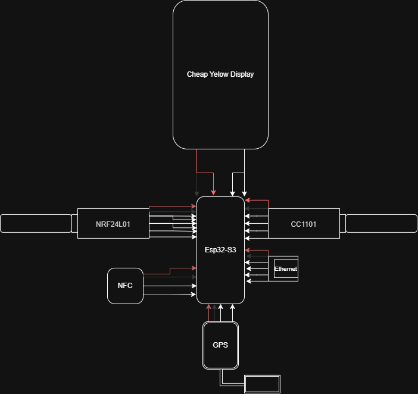

# ESPGraveYard 

**ESPGraveYard** is a modular, handheld hardware platform built for multi-protocol wireless security auditing, network testing, and GPS wardriving powered by **GhostESP** firmware.

It features a dual-microcontroller architecture: an **ESP32-S3** handles all high-performance RF signal processing and hardware expansion modules, while a paired **Cheap Yellow Display (CYD)** serves as a remote touch UI controller via the **GhostLink** UART protocol. This offloads display rendering from the execution board to prevent CPU bottlenecks and kernel crashes.

---

##  Key Features

* **Sub-GHz RF Auditing (CC1101):** Scan, capture, decode, and replay 433MHz signals for IoT and remote control analysis.
* **2.4GHz RF Analysis (NRF24L01+ PA/LNA):** Protocol sniffing and packet injection across the 2.4GHz spectrum.
* **GPS Wardriving & Telemetry (ATGM336H-5N):** Logs real-time NMEA location data directly to a MicroSD card for WiGLE and GIS map visualization.
* **Wired Network Testing (W5500 SPI Ethernet):** Hardware Ethernet connection for local network enumeration, packet sniffing, and DNS testing over SPI.
* **NFC / RFID Proximity Scanning (PN532):** Reads and decodes 13.56MHz high-frequency cards, access tags, and transit credentials.
* **USB Native HID Attacks (ESP32-S3 OTG):** Native USB On-The-Go capabilities for automated keystroke injection (BadUSB) and mass storage emulation.
* **GhostLink Serial Control:** Dedicated serial communication link connecting the Cheap Yellow Display UI directly to the main processing unit.

---

## 📐 Hardware Architecture & Wiring

### GPIO Pinout Mapping

| Component | Interface | ESP32-S3 GPIO | Function |
| :--- | :--- | :--- | :--- |
| **CC1101 Transceiver** | SPI / CS | GPIO 10 | Sub-GHz Radio |
| **W5500 Ethernet** | SPI / CS | GPIO 14 | SPI Ethernet Controller |
| **NRF24L01+ Transceiver** | SPI / CS, CE | GPIO 9 (CS), GPIO 8 (CE) | 2.4GHz RF |
| **MicroSD Card Module** | SPI / CS | GPIO 4 | Log & Asset Storage |
| **PN532 NFC Module** | I2C | GPIO 1 (SDA), GPIO 2 (SCL) | High-Frequency RFID |
| **ATGM336H GPS** | Hardware UART | RX / TX (Dedicated) | NMEA Telemetry |
| **GhostLink** | Serial UART | RX / TX (Dedicated) | Remote Touch Interface |

---

## 🛒 Bill of Materials (BOM)

| Part Name | Qty | Price (RON) | Price (EUR) |
| :--- | :---: | :---: | :---: |
| ESP32-S3 DevKitC-1 Board (16MB Flash) | 1 | 72.78 | 14.64 |
| CC1101 433MHz Transceiver Module | 1 | 33.64 | 6.77 |
| ATGM336H-5N GPS Module | 1 | 49.90 | 10.04 |
| W5500 SPI Ethernet Module | 1 | 47.40 | 9.54 |
| NRF24L01+ PA/LNA Transceiver Set | 1 | 35.78 | 7.20 |
| 32GB MicroSD Card | 1 | 59.90 | 12.05 |
| PN532 NFC / RFID Module | 1 | 38.77 | 7.80 |
| Prototype Perfboard 4x6 cm (3 pcs) | 3 | 13.44 | 2.70 |
| 4-Pin LED Cable & Cynel Solder Wire | 2 | 63.92 | 12.87 |
| **Total** | | **415.53 RON** | **€83.61** |

